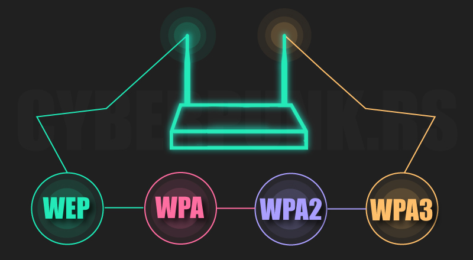

Air::Lorcon2
================================================



  

**WHO I AM?**

Click [Here](https://github.com/Baseband-processor/Baseband-processor)


**WHY PERL AND WHY LORCON?**

Since my first day as (self-taught) "computer science student"  I found the Perl language even better than Python,I spent the last 3 years studying Computer Security, especially Wireless security (this includes also the WLAN security).

One day, while I was browsing on metacpan I found Net::Lorcon2, an old library with little documentation and limited support to the original Lorcon2 library, at first I didn't consider it and I continued to study, but a few months ago I had the desire to design something which actually lacks in the perl community:
The theme of cybersecurity and its related applications.

This is just the beginning, the project is long and the road is much longer but I hope that, with the help of the community, it would be possible to bring the world of cybersecurity into Perl, a language that now boasts very few tools (one of the few that comes to mind is Nikto), and which is still focused only both on automation and on CGI programming.

**REQUIREMENTS**

- [x] perl 
- [x] libpcap
- [x] C compiler (gcc is fine)
- [ ] libnl-dev (optional, required only for using nl80211 capabilities)
- [ ] autoreconf (optional, required only for installing libnl-dev)
- [x] bison (required for both Lorcon and libnl)
- [ ] flex (optional, required only for installing libnl-dev)


**INSTALLATION**

for installing the *Air::Lorcon2* and *Lorcon2* libraries you just need to type:

```shell
   sudo make

```

this will start the Makefile outside the C and perl directories, Lorcon2 Headers will be automatically installed in */usr/include*.
directory.

Since version 17.7 the Makefile has 2 installing options:

* full

* minimal

the difference stands in the _libnl_ and its dependencies, which won't be installed in the _minimal_ installer.

**TEST IF LORCON2 SUPPORTS LOCAL ADAPTERS**

for veryfing that everything works just start typing 
*perl -e '*

```perl

use Air::Lorcon2;
use Data::Dumper;
print Dumper( Air::Lorcon2::lorcon_list_drivers() );

```

if this return no drivers or if in the output there isn't any wireless card try to init the interfaces though the *drv_* functions listed below:

- drv_madwifing_init
- drv_mac80211_init

for now only the mac80211 and madwifing drivers are avaiable, more on future.

**C DOCUMENTATION**
 
some resources about C Lorcon2 library are here:
  - _HACKING EXPOSED™ WIRELESS: WIRELESS SECURITY SECRETS & SOLUTIONS SECOND AND THIRD EDITION_ 
  - https://www.willhackforsushi.com/presentations/shmoocon2007.pdf
  - https://github.com/kismetwireless/lorcon 
  - http://blog.opensecurityresearch.com/2012/09/getting-started-with-lorcon.html

but, as *Mike Kershaw* said:

*there isn't really any documentation on the other functions, sorry; the code would be the best reference there.*

so take advantage of the C open source code.


some resources about libnl library are here:
   - https://www.infradead.org/~tgr/libnl/
   - https://workshop.netfilter.org/2010/wiki/images/0/0d/Libmnl.pdf
   - https://github.com/thom311/libnl
   
 Resources about various aspect of wireless protocols:
   - https://www.cwnp.com/uploads/802-11i_key_management.pdf            
   - [Official Wi-fi standard specifications ](https://www.wi-fi.org/discover-wi-fi/specifications)
   - [LDPA 802.11 guide, 2700+ pages](https://legal.vvv.enseirb-matmeca.fr/download/amichel/%5BStandard%20LDPC%5D%20802.11-2012.pdf)
   
   
**PERL DOCUMENTATION**

if interested in more advanced examples for the perl library please go under the *examples/* directory.

the most basic usage is:

```perl
use strict;
use Net::Pcap qw( pcap_lookupdev );
use Data::Dumper qw(Dumper);
use Air::Lorcon2 qw(:lorcon); # This will export every lorcon2 subroutines

my $pcap_err = '';
my $pcap_interface = pcap_lookupdev( \$pcap_err ); # This will give us the best interface avaiable for sniffing 

print Dumper( lorcon_list_drivers() ) or die $!;
my $driver = <STDIN>;
chomp( $driver ); # Delete the 'ret' character from the $driver string
my $drv = lorcon_find_driver( $driver );

my $context = lorcon_create($pcap_interface, $drv) or die $!;

# From here we have access to an huge number of functions, some simple examples are:

lorcon_ifdown( $context ) or die lorcon_get_error( $context ); # Set interface 'down'
lorcon_ifup( $context ) or die lorcon_get_error( $context ); # Set interface 'up'

my $channel = 2;

lorcon_set_channel( $context, $channel ) or die lorcon_get_error( $context ); # set channel to 2
lorcon_get_channel( $context ) or die lorcon_get_error( $context ); # return the channel, in this case 2

lorcon_open_inject (  $context ) or die lorcon_get_error( $context ); # set the injection mode
lorcon_open_monitor(  $context ) or die lorcon_get_error( $context ); # set the monitor mode
lorcon_open_injmon (  $context ) or die lorcon_get_error( $context ); # set both

# We can also initialize our preferred network driver using

drv_madwifing_init( $context ); 

# ||

drv_mac80211_init( $context ); 

# And if we add a packet the possible uses  grows exponentially:

my $Packet = "\xdd\x09\x00\x50\xf2\x04\x10\x4a\x00\x01\x10"; # WPS probe packet taken by Air::Reaver, another my module for Reaver

# || 

my $Packet = Packet_to_hex("sample_packet"); # return a hexadecimal version of "sample_packet" with \x format

lorcon_send_bytes( $context, length($Packet), \$Packet ); # this will send the raw bytes though the network

# NOTE:
# Since version 17.6 is possible to use also this simplified function:

print Send_Bytes( $context, $Packet); 
# The $Packet length is processed in the Back-End.

```

**SPECIAL THANKS**

A great thanks to *Andreas Hadjiprocopis* (aka *Bliako*), probably the best collaborator I ever had, without him the biggest part related to the C code would be broken.

**other thanks**
* perlmonks community, especially syphilis  for his initial help
* *Mike Kershaw* (aka Dragorn), the main developer of Lorcon2, who explained some obscure part of his code
* *GomoR*, the old author, who never replied to my emails even when I sent the 10.5 Air::Lorcon2 version

**Future works and directions**

This library is the result of 2 months of hard work and, still now, there are several problem related to the perl-types conversion, 
Probably the project will grow even more, my main ideas are:

- [ ] offer a full coverage for the Lorcon2 library
- [ ] develop a big amount of perl-based-subroutines, despite the function-avaiability, lorcon2 is a finite project, it's our work to make it infinite.
- [ ] Integrate Air::Lorcon2 with other modules, those are:

   * Air::Reaver -> interface to reaver WPS library
   * Air::Pcap -> interface to airpcap library
   * Air::Crack -> interface to aircrack-ng
   * Air::Driver -> interface for handling supported linux wireless drivers
   * Air::FakeAP -> implementation of Fluxion
   * Air::Writer -> write your own wireless driver
   * Air::Wireless -> pure perl subroutines for managing basic wireless operations
   
   
- [ ] Write a brief PDF manual about the six perl wireless-security module

**Other suggested Perl libraries for network security**

unfortunately perl doesn't have the same number of libraries as python, but some exists!
for starting I suggest to learn:

* [Socket](https://metacpan.org/pod/Socket)
* [Net::Pcap](https://metacpan.org/pod/Net::Pcap)
* [Net::Ncap](https://metacpan.org/pod/Net::Ncap)
* [Net::Frame](https://metacpan.org/pod/Net::Frame)
* [NetPacket](https://metacpan.org/pod/NetPacket)
* [Net::Write](https://metacpan.org/pod/Net::Write)
* [Net::Analysis](https://metacpan.org/pod/Net::Analysis)
* [Net::Silk](https://metacpan.org/pod/Net::Silk)
* [Net::Inspect](https://metacpan.org/pod/Net::Inspect)
* [Net::Tshark](https://metacpan.org/pod/Net::Tshark)
* [Net::Sharktools](https://metacpan.org/pod/Net::Sharktools)
* [File::PCAP](https://metacpan.org/pod/File::PCAP)
* [Net::P0f](https://metacpan.org/pod/Net::P0f)
* [Net::Pcap::Reassemble](https://metacpan.org/pod/Net::Pcap::Reassemble)
* [Nagios::NRPE](https://metacpan.org/pod/Nagios::NRPE)
* [Net::Connection::Sniffer](https://metacpan.org/pod/Net::Connection::Sniffer)
* [Net::ARP](https://metacpan.org/pod/Net::ARP)

**PERL NETWORK SECURITY RESOURCE**

* _Automating System Administration with Perl_ (Probably one of the best books for the blue team field practices in Perl)
* _Network Programming With Perl (by Lincoln Stein, 2001)_ (even if old, still remains the best networking book for Perl developers)
* [Practical PERL for Security Practitioners](https://www.sans.org/reading-room/whitepapers/scripting/practical-perl-security-practitioners-1357)
* [Perl for Penetration Testing](https://www.slideshare.net/kost/perl-usage-in-security-and-penetration-testing)


**Requests and collaborations**

Feel free to email me at <Baseband@cpan.org>
- [x] I am open to suggestions, code improvement, collaboration and other requests


**FREE DROPS**

Occasionally I'll drop some random hardware extension for Air::Lorcon2, this will include specific hardware, customized extension and new working modes.

**CURRENT VERSION**

After a long development stage, the actual version of Air::Lorcon2 is 17.7, for more about the enhancement of various functions see the _Change_ file inside the Perl directory.

**Air::Lorcon2's Metacpan version**

As you may understand, Air::Lorcon2 has an autoinstaller, which couldn't be executed normally running the classical

```shell
sudo cpanm Air::Lorcon2
```
So in the future I'll fork the project for a cpan compatible library.


**CHECKSUMS**

_the checksum will be updated every 14 days_

**MD5:** _c66fdd9da209e4d5ab39fd5056cb6d09_

**SHA1:** _ff14e23978bcdfaa501ae4da0290f71b54efef1a_

**SHA256:** _408848d7666490300423c912f36c5b67b1ed54f5101c1864d7e5a8496d1f7e6e_

**NOTE:**  The checksum is related to the zipped file.


**COPYRIGHT AND LICENCE**

Copyright (C) 2020 by *Edoardo Mantovani*, aka BASEBAND


This library is free software; you can redistribute it and/or modify
it under the same terms as Perl itself, either Perl version 5.8.8 or,
at your option, any later version of Perl 5 you may have available.


